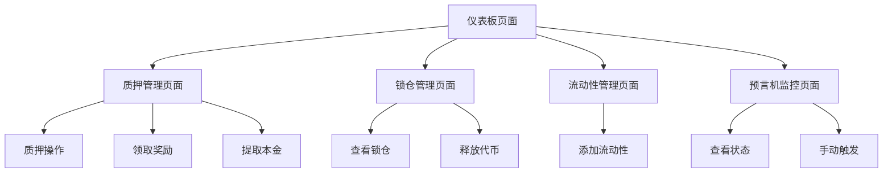

# Astra Token 前端应用产品需求文档

## 1. Product Overview

Astra Token 是一个完整的 DeFi 生态系统，包含代币管理、质押奖励、锁仓释放、流动性管理和预言机监控功能。本前端应用为用户提供简洁直观的界面来与智能合约交互。

- 解决用户与复杂智能合约交互的技术门槛问题，提供友好的图形化界面
- 目标用户为 DeFi 投资者、代币持有者和流动性提供者
- 通过简化操作流程，降低用户使用门槛，提升 DeFi 产品的可用性

## 2. Core Features

### 2.1 User Roles

| Role | Registration Method | Core Permissions |
|------|---------------------|------------------|
| 普通用户 | MetaMask 钱包连接 | 查看余额、质押、锁仓释放、添加流动性 |
| 管理员 | 合约 Owner 权限 | 预言机监控、参数配置、紧急操作 |

### 2.2 Feature Module

我们的 Astra Token 前端应用包含以下主要页面：

1. **仪表板页面**: 钱包连接、余额显示、功能导航
2. **质押管理页面**: 代币质押、奖励领取、本金提取
3. **锁仓管理页面**: 锁仓查询、代币释放
4. **流动性管理页面**: Uniswap 流动性添加
5. **预言机监控页面**: 状态查看、手动触发检查

### 2.3 Page Details

| Page Name | Module Name | Feature description |
|-----------|-------------|---------------------|
| 仪表板页面 | 钱包连接模块 | 连接 MetaMask 钱包，显示连接状态和地址 |
| 仪表板页面 | 余额显示模块 | 实时显示 ASTRA 代币余额和 ETH 余额 |
| 仪表板页面 | 功能导航模块 | 提供各功能模块的快速入口和状态概览 |
| 质押管理页面 | 质押操作模块 | 输入数量质押 ASTRA 代币，显示质押状态 |
| 质押管理页面 | 奖励管理模块 | 查看待领取奖励，一键领取质押奖励 |
| 质押管理页面 | 提取模块 | 输入数量提取已质押的本金 |
| 锁仓管理页面 | 锁仓查询模块 | 显示锁仓总量、已释放量、可释放量和时间进度 |
| 锁仓管理页面 | 释放操作模块 | 一键释放当前可用的锁仓代币 |
| 流动性管理页面 | 流动性添加模块 | 输入 ASTRA 和 ETH 数量，添加到 Uniswap 流动性池 |
| 流动性管理页面 | 状态显示模块 | 显示当前流动性池状态和合约余额 |
| 预言机监控页面 | 监控状态模块 | 显示上次检查时间、流动性变化、检查窗口 |
| 预言机监控页面 | 手动触发模块 | 管理员手动触发预言机检查和销毁操作 |

## 3. Core Process

**普通用户操作流程：**
用户首先连接 MetaMask 钱包 → 在仪表板查看代币余额 → 选择功能模块（质押/锁仓/流动性）→ 执行相应操作 → 确认交易 → 查看操作结果

**管理员操作流程：**
管理员连接钱包 → 访问预言机监控页面 → 查看监控状态 → 手动触发检查操作 → 配置监控参数

## 4. User Interface Design

### 4.1 Design Style

- **主色调**: 蓝色 (#3B82F6) 和白色 (#FFFFFF)
- **辅助色**: 浅蓝色 (#EFF6FF)、深蓝色 (#1E40AF)、灰色 (#6B7280)
- **按钮样式**: 圆角按钮，蓝色背景，白色文字，悬停时加深
- **字体**: 系统默认字体，标题 18-24px，正文 14-16px
- **布局风格**: 卡片式布局，顶部导航，左右分栏或单栏布局
- **图标风格**: 简洁的线性图标，与蓝白主题协调

### 4.2 Page Design Overview

| Page Name | Module Name | UI Elements |
|-----------|-------------|-------------|
| 仪表板页面 | 钱包连接模块 | 蓝色连接按钮，连接状态指示器，地址显示卡片 |
| 仪表板页面 | 余额显示模块 | 白色背景卡片，蓝色边框，大号数字显示余额 |
| 质押管理页面 | 质押操作模块 | 输入框（白色背景，蓝色边框），蓝色质押按钮 |
| 质押管理页面 | 奖励管理模块 | 奖励数量显示卡片，蓝色领取按钮，进度条显示 |
| 锁仓管理页面 | 锁仓查询模块 | 进度条（蓝色填充），时间倒计时，状态卡片 |
| 流动性管理页面 | 流动性添加模块 | 双输入框布局，滑点设置，蓝色确认按钮 |
| 预言机监控页面 | 监控状态模块 | 状态指示灯，时间显示，参数配置面板 |

### 4.3 Responsiveness

产品采用桌面优先设计，同时适配移动设备。在移动端将采用单栏布局，按钮和输入框适当放大以便触摸操作。支持横屏和竖屏切换。