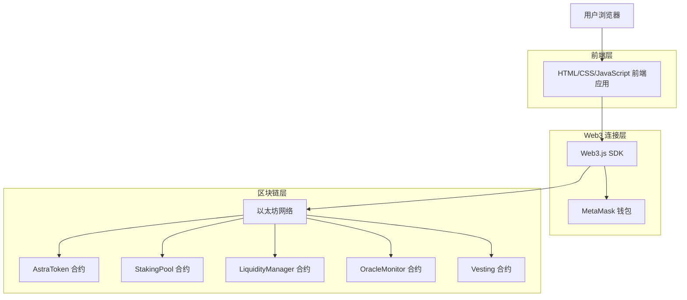
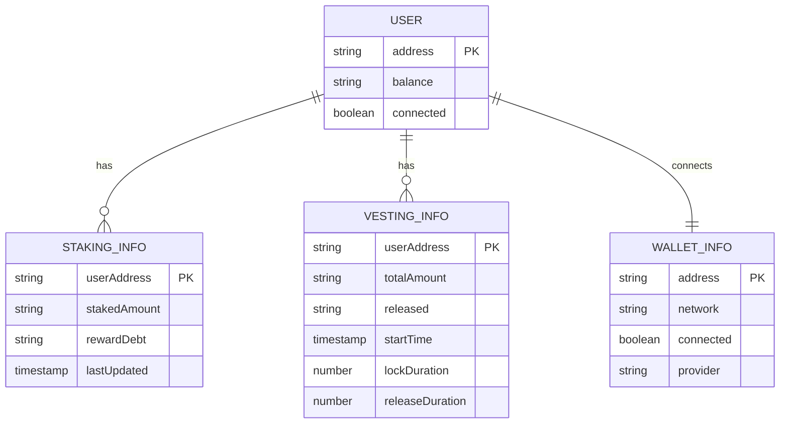

# Astra Token 前端应用技术架构文档

## 1. Architecture design



## 2. Technology Description

- Frontend: HTML5 + CSS3 + Vanilla JavaScript + Web3.js
- Wallet: MetaMask 集成
- Blockchain: 以太坊网络（支持主网和测试网）

## 3. Route definitions

| Route | Purpose |
|-------|---------|
| /index.html | 主页面，包含所有功能模块的单页应用 |
| #dashboard | 仪表板视图，显示余额和功能导航 |
| #staking | 质押管理视图，处理质押相关操作 |
| #vesting | 锁仓管理视图，处理锁仓释放操作 |
| #liquidity | 流动性管理视图，处理 Uniswap 流动性操作 |
| #oracle | 预言机监控视图，显示监控状态和管理操作 |

## 4. API definitions

### 4.1 Core API

智能合约交互接口

**AstraToken 合约**
```javascript
// 查询余额
balanceOf(address): Promise<BigNumber>

// 授权代币
approve(spender, amount): Promise<TransactionResponse>

// 查询授权额度
allowance(owner, spender): Promise<BigNumber>
```

**StakingPool 合约**
```javascript
// 质押代币
stake(amount): Promise<TransactionResponse>

// 领取奖励
claimReward(): Promise<TransactionResponse>

// 提取本金
withdraw(amount): Promise<TransactionResponse>

// 查询待领取奖励
pendingRewards(user): Promise<BigNumber>

// 查询质押信息
stakers(user): Promise<{amount, rewardDebt, lastUpdated}>
```

**Vesting 合约**
```javascript
// 查询可释放数量
releasableAmount(user): Promise<BigNumber>

// 释放代币
release(): Promise<TransactionResponse>

// 查询锁仓计划
schedules(user): Promise<{totalAmount, released, startTime, lockDuration, releaseDuration}>
```

**LiquidityManager 合约**
```javascript
// 添加流动性
addLiquidityFromContract(tokenAmount, minToken, minETH, deadline): Promise<TransactionResponse>

// 查询流动性价值
getLiquidityValue(): Promise<BigNumber>
```

**OracleMonitor 合约**
```javascript
// 检查并销毁
checkAndBurn(): Promise<TransactionResponse>

// 更新参数
updateParams(window, burnAmount): Promise<TransactionResponse>

// 查询状态
lastLiquidity(): Promise<BigNumber>
lastChecked(): Promise<BigNumber>
windowSeconds(): Promise<BigNumber>
burnAmount(): Promise<BigNumber>
```

## 5. Data model

### 5.1 Data model definition



### 5.2 Data Definition Language

**前端本地存储结构**

```javascript
// 用户连接状态
const userState = {
  address: "0x...",
  balance: "1000.0",
  connected: true,
  network: "sepolia"
};

// 质押信息缓存
const stakingCache = {
  stakedAmount: "500.0",
  pendingRewards: "10.5",
  lastUpdated: Date.now()
};

// 锁仓信息缓存
const vestingCache = {
  totalAmount: "1000.0",
  released: "200.0",
  releasable: "50.0",
  progress: 25 // 百分比
};

// 合约地址配置
const CONTRACT_ADDRESSES = {
  astraToken: "0xe8174d551fd69c9ec98a09033c0885a2efbeb52c",
  stakingPool: "0xf035e4d39503c551b1503d7ee1e29826f80cf4b3",
  liquidityManager: "0x18f98d0c305b6c7b2b272407ac5fa04a67df53c7",
  oracleMonitor: "0x5e4760f19dabec6711e46ec25d9a2aac50b63f2d"
};

// 网络配置
const NETWORK_CONFIG = {
  sepolia: {
    chainId: "0xaa36a7",
    chainName: "Sepolia Test Network",
    rpcUrls: ["https://sepolia.infura.io/v3/"],
    blockExplorerUrls: ["https://sepolia.etherscan.io"]
  }
};
```